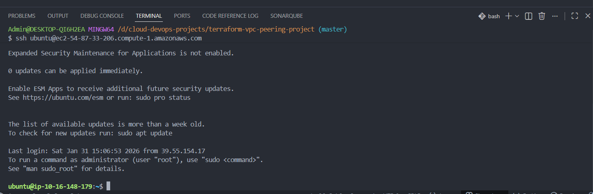
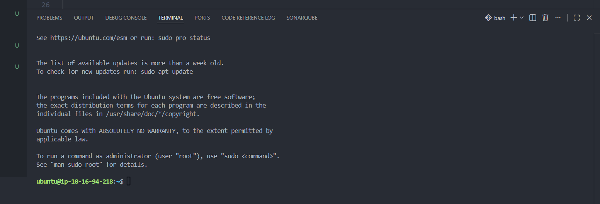
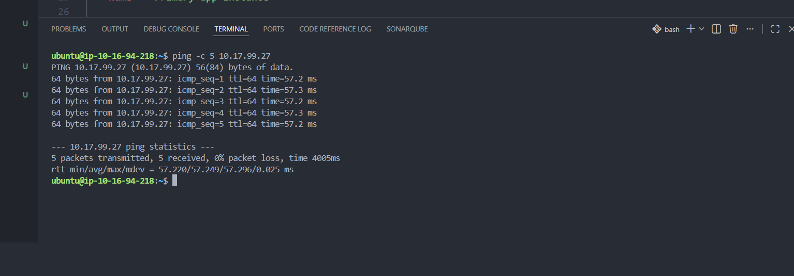
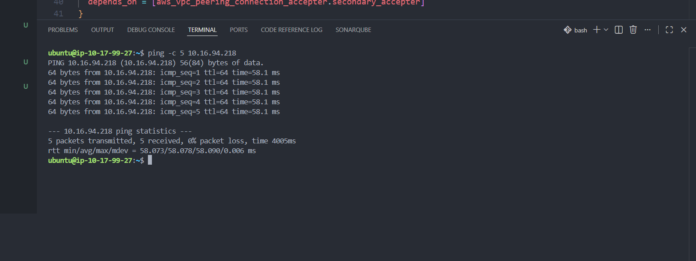

## 
🔒 VPC Peering across regions (Same Account) using Terraform 

Enabled secure, private cross-region communication between **Primary VPC** and **Secondary VPC** on AWS (same account) using **VPC Peering** and **Terraform**.

---

### Live Demo:

Established SSH connection to Jumpbox using SSH agent forwarding

Connected from Jumpbox to a private EC2 instance (**Primary VPC**) using the same SSH key

Pinged private EC2 instance in **Secondary VPC** from private EC2 instance in **Primary VPC**

Pinged private EC2 instance in **Primary VPC** from private EC2 instance in **Secondary VPC**

---

### Problem:

In our AWS system architecture, we needed private communication between two VPCs (**Primary VPC** and **Secondary VPC**) that exist in **two different AWS regions** within the **same AWS account**.

- **Primary VPC (Region 1)** hosts an EC2 instance in a private application subnet running a backend component such as a **Product Service**.

- **Secondary VPC (Region 2)** hosts another EC2 instance in a private application subnet running an **Order Service**.

- **Secondary VPC** does not allow inbound public internet traffic, and both services run inside private subnets without relying on public IP addresses.

The Product Service must call the Order Service endpoint (e.g., _get all orders by productId_), but by default:

- EC2 instances can communicate privately within the same VPC
- **Two separate VPCs cannot communicate privately** unless explicit networking is configured

As a result, the Product Service in the **Primary VPC** could not reach the Order Service in the **Secondary VPC**.

---

### 🚀 Overview:

This project demonstrates how to enable **secure, private, cross-region communication** between two isolated VPCs (**Primary VPC** and **Secondary VPC**) using **VPC Peering** and **Terraform as Infrastructure as Code (IaC)**.

A **Jumpbox (bastion host)** is used for secure administrative access, following AWS best practices by preventing direct SSH access to private EC2 instances.

---

### 🚀 Key Features

- **Infrastructure as Code (IaC)** using Terraform for automated and repeatable AWS provisioning
- **Remote Terraform state management** using Amazon S3 for centralized and reliable state storage
- **Terraform modules** to reduce duplication and improve maintainability
- **Secure access pattern** using a Jumpbox with SSH agent forwarding

---

### 🚧 Challenges:

- Debugged Jumpbox SSH connectivity issues and fixed them by correcting Terraform HCL function path logic
- Resolved Terraform state conflicts across teams using remote state locking
- Reduced VPC networking code duplication by designing reusable Terraform modules

---

### 🎯 Learning Objectives

- Understand why separate VPCs cannot communicate privately by default
- Learn how to enable private cross-region communication using VPC Peering
- Gain hands-on experience writing Terraform to provision AWS networking components
- Implement least-privilege network security for service-to-service communication
